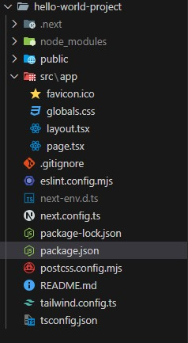

# Project Name

## Description

A brief description of your project, its purpose, and functionality.

## Project Structure

In the root level of the project, we can see the following structure:

- 4 folders
- 10 files



### Files

1. **`package.json`**  
   This file includes all dependencies, devDependencies, and scripts for the
   project, along with the project's name and version.

2. **`eslint.config.mjs`**  
   This file allows you to define custom rules, presets, and plugins for ESLint,
   ensuring the project adheres to specific coding standards and guidelines.

3. **`tailwind.config.ts`**  
   Configures and customizes Tailwind CSS for your project. It allows you to
   extend the default Tailwind configuration.

4. **`postcss.config.mjs`**  
   Used for transforming CSS with JavaScript plugins. Tailwind CSS uses PostCSS
   to process its styles, and this configuration is required.

5. **`package-lock.json`**  
   An automatically generated file that records the exact versions of
   dependencies and their nested dependencies used in the project. It is created
   or updated when `npm install` is run.

6. **`.gitignore`**  
   A configuration file in a Git repository that specifies which files and
   directories Git should ignore, preventing unnecessary or sensitive files from
   being tracked.

7. **`README.md`**  
   A markdown file that serves as the introduction to the project, providing
   essential information for users and contributors.

8. **`/.next`**  
   An automatically generated folder during development and build processes. It
   contains compiled and optimized assets required for the Next.js application.

9. **`/node_modules`**  
   Contains all installed dependencies and their nested dependencies. Created
   automatically when running `npm install` or `yarn install`.

10. **`/public`**  
    Stores static assets that are publicly accessible. These files are served
    directly by the server without any processing.

### Folders

The `src/` folder contains the core of the project and is structured as follows:

#### Folder Explanations:

- **`app/`**  
  Contains App Router logic for handling routes and layout in the application.

- **`pages/`**  
  For Page Router-based projects. Each file in this folder corresponds to a
  route (page) in the application.

- **`components/`**  
  Contains reusable React components that can be used across different parts of
  the project.

- **`styles/`**  
  Contains CSS or SCSS files for styling the project, handling the visual design
  and layout.

- **`lib/`**  
  Houses utility functions and helper libraries used across the project, such as
  API calls or business logic.

- **`hooks/`**  
  Contains custom React hooks for managing state and side effects across
  components.

- **`assets/`**  
  Stores static assets like images, fonts, or other media files that are
  publicly accessible.

## Installation

To get started with the project, follow these steps:

1. Clone the repository:
   ```bash
   git clone https://github.com/yourusername/yourproject.git
   ```
